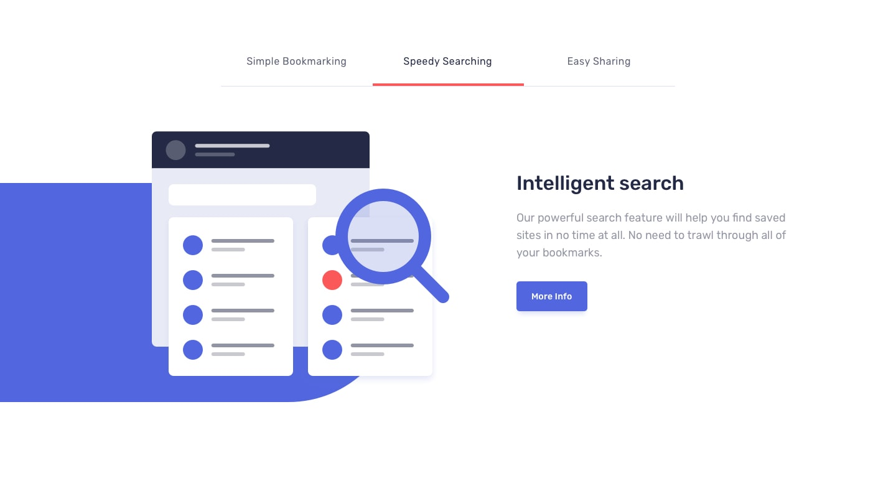
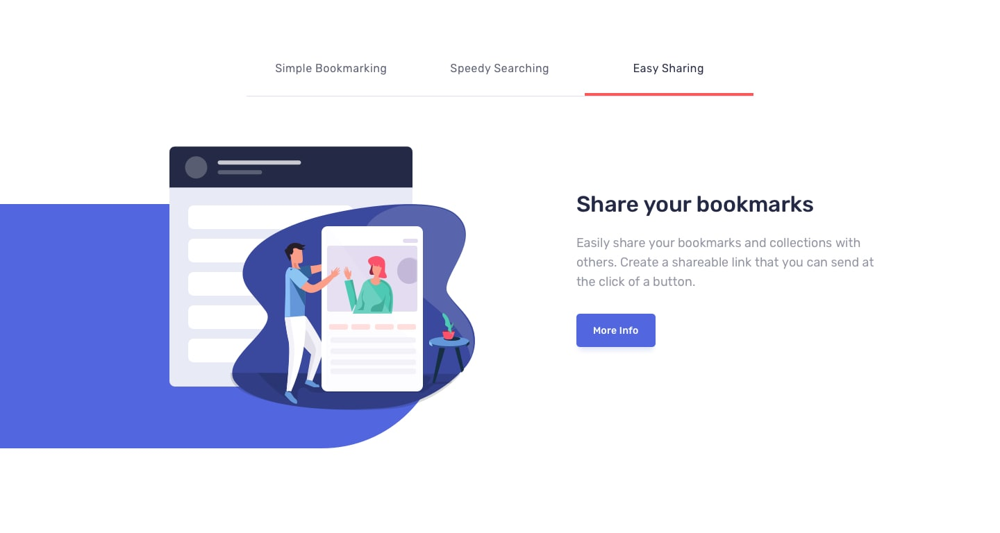

# Bookmark landing page - Frontend Mentor Challenge

Developer: Robin Bosch  
Designed by Frontend Mentor

[View live Site](https://robin-bosch.github.io/bookmark-frontend-mentor)  

## Table of contents

- [Overview](#overview)
    - [The challenge](#the-challenge)
    - [Designs](#designs)
- [My process](#my-process)
    - [Challenges](#challenges)
    - [What I learned](#what-i-learned)
- [Technologies used](#technologies-used)
- [Validation and Testing](#validation-and-testing)
    -
- [Author](#author)
- [Credits](#author)
- [Acknowledgments](#acknowledgments)
- [License](#license)

## Overview

### The challenge

The user should be able to view the page correctly on the most common devices and on every screen size.  
Hover states should be reflected accurately.

### Designs

The following designs were given to build the project:  

The Desktop design with a shown width of 1440px

Intelligent Tab Design

Share your bookmarks Tab Design

Hover states on desktop

The Mobile design with a shown width of 375px

Navigation menu on mobile

## My process

### Challenges

- Getting the interactive elements to work
- Having the blue background pills work on all screen sizes
- Working with two different navigation menus

### What I learned

- First time making a FAQ section in vanilla JavaScript
- First time making a carousel in vanilla JavaScript

## Technologies used

### Languages

- HTML
- CSS
- JavaScript

All was written in plain HTML, CSS and JavaScript.

### Frameworks used

- Fontawesome

## Validation and Testing

### HTML Validation

HTML validation was done with the [W3 HTML validator](https://validator.w3.org/nu/) and came back with no warnings.

### CSS Validation

CSS validation was done with the [W3 CSS validator](https://jigsaw.w3.org/css-validator/) and came back with warnings regarding the variables which are currently not checked.

### Accessibility Testing

Accessibility was checked with the browser extension of the [WAVE validator](https://wave.webaim.org/) and came back with contrast errors for the text which is given from the design and one label error for the email input which is not needed.

### Device Testing

The website was tested on the following devices:

- Windows 11 PC (Screen resolution: 2560x1440)
- Xiaomi MI 9 with Android 11 (Screen resolution: 1080x2280)
- Xiaomi Pad 6 with Android 12 (Screen resolution: 1800x2880)

Other screen resolutions were tested in the browser with dev tools from 2560x1440 down to 320x568.

### Useful resources

Two helpful reference guides I use: 
- [Grid Guide](https://css-tricks.com/snippets/css/complete-guide-grid/)
- [Flexbox Guide](https://css-tricks.com/snippets/css/a-guide-to-flexbox/)

## Credits

- [Frontend mentor](https://www.frontendmentor.io) - For providing me with [this challenge and the designs.](https://www.frontendmentor.io/challenges/easybank-landing-page-WaUhkoDN) 
- [Reset CSS](https://andy-bell.co.uk/a-modern-css-reset/) from Andy Bell

## License

This project is published under the MIT license.  
The challenge itself is excluded from this license.  
[License](/LICENSE.txt)